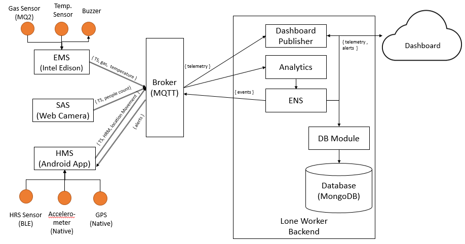

# LoneWorker : Lone Worker reference implementation

## Introduction

The **Lone Worker IoT Solution** is intended to provide a solution that allows assists employers & workers and augments existing mechanisms to ensure worker safety as per the above described regulations. 

***Architecture :***
   

The solution allows for handling of following overall requirements:
1. *Workplace monitoring*: The system provides support for monitoring environmental
parameters in a potentially hazardous workplace such as presence of
harmful/flammable gasses, smoke and high temperatures.
Dissertation: 2015HW12025
12
2. *Early warning*: The system provides an early warning mechanism to the employee
when approaching the potentially hazardous environment such as area with gas
leakage or fire. Although there can be a number of such system distributed all across
the work-place covering various locations, for the purpose of this dissertation only one
such system will be considered.
3. *Health monitoring*: The system will gather health parameters such as heart rate,
movement and location parameters from the person of an employee and provides alert
notification in case of employee in distress.
4. *Surveillance Analysis*: The system provides support for analysing surveillance feed
in a potentially hazardous work-area and raise notifications when a lone worker is
detected or when no movement is detected from the worker. Although there can be a
number of such system distributed all across the work-place covering various
locations, for the purpose of this dissertation only one such system will be considered.
5. *Emergency Notification*: The system will allow an employee to raise alarm when in
self-distress or in case of an emergency.
6. *Backend System*: The backend system is designed to gather telemetry and alert data
from all of the above systems and will perform analysis of the captured parameters.
This system is also be responsible for publishing the telemetry data, surveillance video
data and notifications.
7. *Dashboard*: The dashboard is designed to publish telemetry data gathered from
above system and provide Alert indication. The dashboard is published over cloud and
can be accessed globally from any internet browser enabled device (e.g. PC,
Smartphones and Tablets etc.)

### Author : Kuljeet Singh